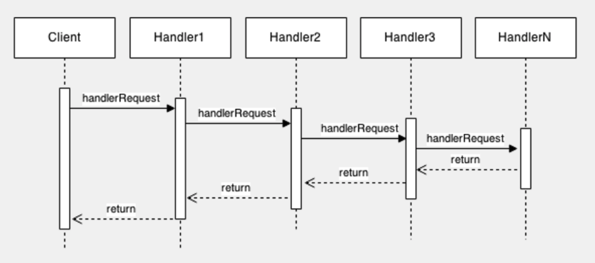

# Chain of Responsibility

## Table of contents

1. Introduction
2. Advantages and Disadvantages
3. Example
4. Execution
5. External Resources

## Introduction

**Chain of responsibility** pattern is a behavioral design pattern that we use to achieve loose coupling in our software design, where a request from the client is passed to a chain of objects to process them. The request will receive through a handler and the objects in the chain will decide themselves who will going to process that request. Each of these objects contain certain type of commands to handle that request. If a particular object cannot handle that request, it will pass the request to the next object in that chain.



**But what happens if no object can handle the request?**

The common solution to avoid this scenario, is to define in the base handler a way to handle the request in a simple way so that for each request, at least one handler can take care of it.

## Advantages and Disadvantages

The main advantages of applying this pattern are:

- Decouples the sender of the request and its receivers.
- Simplifies your object because it doesn’t have to know the chain’s structure and keep direct reference to its members.
- Allows you to add or remove responsibilities dynamically by changing the members or the order of the chain.

On the other hand, this pattern brings with it some disadvantages which are the following:

- Can be hard to observe the runtime characteristics and debug.
- If a handler fails to call the next handler, the request gets dropped.
- If a handler calls the wrong handler, it can lead to a cycle. So, the request must be received not guarantee.

## Example

The problem for which it is developed a solution in this project is for an hypothetical case where we have to develop the logic of an ATM which can only withdraw money in bills of either $20, $50 or $70. Therefore, before accepting a transaction, the ATM will calculate if the amount in the input can be withdrawn using only these bills.


In order to solve this problem, we have decided to implement, by using the Chain of Responsibility pattern, a series of handlers in which each of them will check if the amount can be divisible by a particular amount (this amount corresponds to one of the available bills).

## Execution

In order to run the following code, you should use a Typescript compiler and play around with the examples indicated at the end of the ```chain-responsibility-pattern-test.ts``` file.

## External Resources

1- Understanding the Chain of Responsibility Pattern [https://medium.com/geekculture/understanding-the-chain-of-responsibility-pattern-d729ef84621c](https://medium.com/geekculture/understanding-the-chain-of-responsibility-pattern-d729ef84621c) 

2- Chain of Responsibility pattern [https://ducmanhphan.github.io/2019-02-27-Chain-of-Responsibility-pattern/](https://ducmanhphan.github.io/2019-02-27-Chain-of-Responsibility-pattern/)
